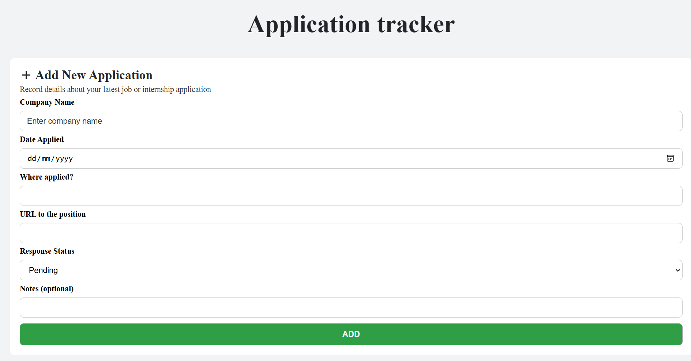

# 📋 Application Tracker

A web application that helps users track and manage their job or internship applications in one place.

---

## 🛠 Tools Used

- **React** – Frontend framework  
- **Supabase** – Backend services (auth, database, APIs)  
- **React Icons** – Icons and UI visual aids  
- **React Hot Toast** – Toast notifications  
- **Styled Components** – For scoped component-level CSS styling

---

## 🚀 How to Run the Application

1. Create a file named `constants.js` inside the `src` directory.
2. Add the following content to it:

```js
export const PAGE_COUNT = 'Used for pagination';
export const SUPABASE_URL = 'Uses supabase';
export const SUPABASE_KEY = 'Uses supabase';
```
3. Install dependencies and start the development server:
```bash
npm install
npm run dev
```
## 📸 Screenshots



## ✅ Features
- **Add and track** applications with fields like company name, status, date, and platform.
- **Filter** by response status (Pending, Rejected, Selected, etc.)
- **Sort** applications by date.
- **Delete** application records easily.